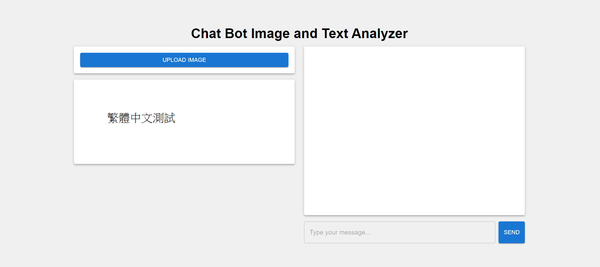
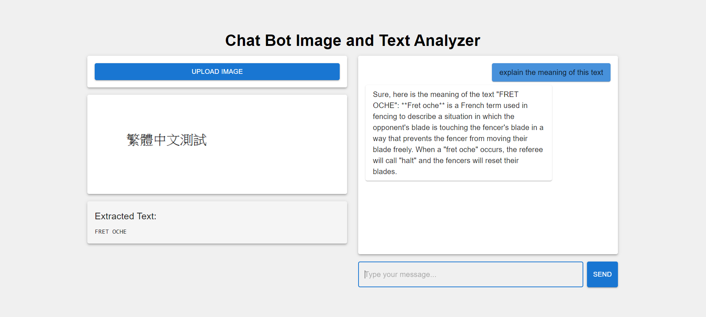

# Image-and-Text-Analysis-ChatBot

This project is a chatbot that analyzes images and text using the Gemini API. It features a React frontend, Express.js backend, and MongoDB database.

## Setup

### Prerequisites

- Node.js (v14 or later)
- MongoDB
- Gemini API key

### Installation

1. Clone the repository:
   - git clone https://github.com/krtk-097/Image-and-Text-Analysis-ChatBot.git
   - cd Image-and-Text-Analysis-ChatBot
   
2. Install dependencies for both frontend and backend:
   - cd frontend
   - npm install
   - cd ../backend
   - npm install
   
3.  Set up environment variables:
    - Create a `.env` file in the backend directory with the following:
    - MONGODB_URI=your_mongodb_connection_string
    - GEMINI_API_KEY=your_gemini_api_key

## Usage

1. Start the backend server:
   - cd backend
   - npm run dev

2. In a new terminal, start the frontend development server:
   - cd frontend
   - npm run dev

3. Open your browser and navigate to `http://localhost:5173` (or the port specified by Vite).

4. Use the chat interface to interact with the bot. You can upload images and send text queries for analysis.

## Testing the Application

To demonstrate the functionality of the Image-and-Text-Analysis-ChatBot, you can test it with sample images. Here are a few examples:

1. Upload an image:

2. Text query response:

## Features

- Image analysis using Gemini API
- Text-based queries and responses
- Chat history stored in MongoDB
- Responsive React frontend

## Technologies Used

- Frontend: React (with Vite)
- Backend: Express.js, Node.js
- Database: MongoDB
- AI API: Gemini
